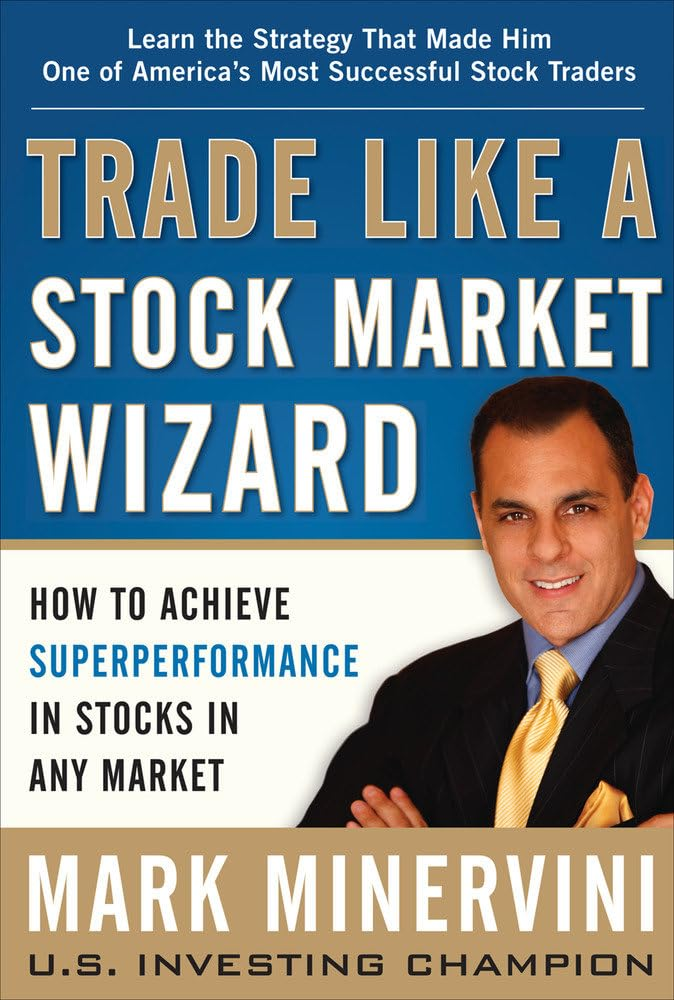

# 💸Dumok of WallStreet

> 성진의 Claude 금융 시장 분석 플러그인


## 💾설치 방법

> 추후 작성 예정

## 📚전문가 소개

| 전문가 | 전문 분야 | 분석 시간대 | 참조 출처 |
|--------|----------|-----------|----------|
| Minervini | 실적 기반 기술적 분석 (SEPA) | 수 주 ~ 수 개월 | [Trade Like a Stock Market Wizard](https://a.co/d/0jkIyj9M) |
| Serenity | 공급망 병목 & 펀더멘탈 | 중기 (카탈리스트 기반) | [Twitter @aleabitoreddit](https://x.com/aleabitoreddit) |
| SidneyKim0 | 매크로 통계 & 레짐 분류 | 사이클 의존적 | [YouTube @sidneykim0](https://www.youtube.com/@sidneykim0) |
| TraderLion | 모멘텀 & 기관 매집 추적 | 5 ~ 20일 | [The Trader's Handbook](https://a.co/d/02mK4W3K) |
| Williams | 단기 변동성 돌파 | 2 ~ 5일 | [Long-Term Secrets to Short-Term Trading](https://a.co/d/09HI0QoX) |

---

### 1. Minervini

> "얼마를 잃을 수 있는가?"를 먼저 묻는 보수적 공격주의자. 펀더멘탈·기술적·정성적·시장 환경이 동시에 수렴할 때만 매수한다.

[](https://a.co/d/0jkIyj9M)

**방법론 특징**
- Trend Template 8가지 기준을 필수 통과해야 후보 자격
- Stage 2(상승 국면)에 있는 종목만 매수
- 실적 서프라이즈와 가속 추적 — 어닝 시즌이 곧 카탈리스트
- 리스크를 먼저 계산하고, 기대값이 맞을 때만 진입

**이런 질문을 해보세요**

| 질문 유형 | 예시 질문 |
|----------|----------|
| 시장 환경 | "장 어때?", "지금 주식 해도 돼?" |
| 종목 진단 | "NVDA 어때?", "이 종목 괜찮아?" |
| 종목 발굴 | "뭐 살까?", "AI 관련주 스크리닝" |
| 매매 타이밍 | "지금 사도 돼?", "언제 사야 해?" |
| 포지션 관리 | "이거 팔아?", "손절해야 하나?" |
| 리스크 점검 | "과매수?", "PE 높은데 괜찮아?" |
| 종목 비교 | "NVDA vs AMD 뭐가 나아?" |

**기대할 수 있는 분석**: Trend Template 통과 여부, Stage 분석, 실적 가속 추이, 매수/매도 시그널과 근거, 리스크 대비 기대수익 계산까지 포함된 종합 진단을 받을 수 있습니다.

---

### 2. Serenity

> 모든 투자 판단은 물리적 공급망 추적에서 시작한다. 차트 위의 선보다 float과 펀더멘탈을 먼저 본다.

[](https://x.com/aleabitoreddit)

**방법론 특징**
- 6단계 증거 체인: 매크로 → 섹터 → 병목 → 기업 → 밸류에이션 → 카탈리스트
- 공급망 병목이 곧 투자 기회 — 수요 > 공급 구간을 찾는다
- First-principles 밸류에이션으로 현재 가격의 합리성 검증
- 카탈리스트 타이밍에 맞춰 진입, 테마 포트폴리오 구성 가능

**이런 질문을 해보세요**

| 질문 유형 | 예시 질문 |
|----------|----------|
| 매크로 환경 | "장 어때?", "금리 방향?", "유동성?" |
| 종목 진단 | "SMCI 분석해줘", "실적 어때?" |
| 테마 발굴 | "AI 관련주", "반도체 공급망", "다음 테마?" |
| 공급망·병목 | "AI 공급망 병목 어디?", "시나리오 분석" |
| 포지션·리스크 | "언제 사?", "리스크?", "타이밍?" |
| 포트폴리오 | "AI 테마 포트폴리오 구성해줘" |

**기대할 수 있는 분석**: 매크로부터 기업까지 6단계를 관통하는 증거 체인, 공급망 병목 스코어링, 펀더멘탈 기반 밸류에이션, 그리고 카탈리스트 타임라인이 포함된 분석을 받을 수 있습니다.

---

### 3. SidneyKim0

> 내러티브보다 숫자. 매크로 레짐을 먼저 분류하고, 확률과 표본 크기로 말한다.

[](https://www.youtube.com/@sidneykim0)

**방법론 특징**
- 시장 사이클 분류: 실적장세 / 역금융장세 / 역실적장세 / 유동성쏠림
- 교차자산 괴리 탐지 — 금리·주가·골드·달러 간 불일치를 포착
- 역사적 유사 구간 매칭으로 확률적 시나리오 구성
- US 시장 전용

**이런 질문을 해보세요**

| 질문 유형 | 예시 질문 |
|----------|----------|
| 시장 레짐 | "현재 사이클?", "bull인가 bear인가?" |
| 교차자산 괴리 | "금리랑 주가 괴리?", "골드가 이상해" |
| 역사적 유사기간 | "지금이랑 비슷한 과거?", "analog 찾아줘" |
| 매크로 데이터 | "유동성?", "Fed 정책?", "yield curve?" |
| 정량 모델 | "S&P Z-score?", "RSI percentile?" |
| 밸류에이션 | "CAPE?", "고평가?", "주식 vs 채권?" |
| 전략 포지셔닝 | "어디에 롱/숏?", "risk-reward?" |

**기대할 수 있는 분석**: 현재 시장이 어떤 사이클에 있는지 데이터 기반으로 분류하고, 교차자산 괴리와 역사적 유사 구간을 근거로 확률적 시나리오를 제시합니다.

---

### 4. TraderLion

> 예측이 아닌 프로세스. 볼륨 엣지와 상대강도로 기관 매집을 식별하고, 시장 사이클에 따라 공격도를 조절한다.

[](https://a.co/d/02mK4W3K)

**방법론 특징**
- S.N.I.P.E. 워크플로우: 체계적 종목 발굴 → 진입 → 관리 프로세스
- 볼륨 엣지(HVE/HVIPO/HV1)로 기관 참여 여부 판별
- 엣지당 +2.5% 포지션 사이징 — 근거가 많을수록 비중 확대
- 시장 사이클에 따른 공격도 조절 (확인된 상승장에서만 풀 사이즈)

**이런 질문을 해보세요**

| 질문 유형 | 예시 질문 |
|----------|----------|
| 시장 사이클 | "시장 어때?", "지금 공격적으로 가도 돼?" |
| 엣지 평가 | "PLTR 엣지 있어?", "볼륨 분석해줘" |
| 셋업·진입 | "Launch Pad 셋업?", "언제 사?" |
| 스크리닝 | "워치리스트 만들어줘", "S.N.I.P.E. 돌려줘" |
| 리스크·포지션 | "포지션 사이징?", "언제 팔아?" |
| 루틴·리뷰 | "트레이딩 루틴?", "포스트 분석" |
| 종목 비교 | "PLTR vs AXON 비교" |

**기대할 수 있는 분석**: 시장 환경 진단, 볼륨 엣지 기반 기관 매집 신호, 상대강도 랭킹, 진입 셋업 판정, 그리고 엣지 수에 따른 포지션 사이징 권고를 받을 수 있습니다.

---

### 5. Williams

> 모든 트레이드는 규칙 기반. 변동성 돌파로 진입하고, 첫 수익 시가에 청산한다. 채권이 주식을 이끈다.

[](https://a.co/d/09HI0QoX)

**방법론 특징** (Pipeline-Complete v3.1.0)
- 변동성 돌파 시스템: Open + Pct × ATR로 기계적 진입 레벨 산출
- TDW/TDM 캘린더 바이어스 — 요일·월별 통계적 편향 활용
- 채권 필터(TLT) — 채권 시장이 주식 방향의 선행 지표
- 10개 팩터 복합 스코어링 (100점) — Hard/Soft Gates + 보너스 포인트
- GSV (Greatest Swing Value) — 실패 스윙 측정 기반 진입/손절 레벨
- 포지션 관리 리체크 — 5개 출구 시그널 + 판정(HOLD/EXIT)
- 2~5일 보유, 첫 수익 시가에 청산하는 단기 트레이딩

**이런 질문을 해보세요**

| 질문 유형 | 예시 질문 |
|----------|----------|
| 시장 환경 | "장 분위기 어때?", "채권 상황?" |
| 트레이드 검증 | "AAPL 사도 돼?", "SPY 셋업 있어?" |
| 패턴 발굴 | "스매시 데이 찾아줘", "패턴 있는 종목?" |
| 진입 타이밍 | "언제 들어가?", "진입 레벨?" |
| 포지션 관리 | "언제 나가?", "손절할까?" |
| 워치리스트 | "이 종목들 중에 뭐가 좋아?" |
| 퀵 체크 | "오늘 방향?", "TDW?", "채권?" |

**기대할 수 있는 분석**: 변동성 돌파 진입 레벨, TDW/TDM 캘린더 바이어스, 채권 인터마켓 필터 상태, 패턴 탐지 결과, 그리고 포지션 사이징까지 포함된 기계적 트레이드 판정을 받을 수 있습니다.

---

## 🤖MarketData 스킬

모든 전문가가 공유하는 데이터 수집 인프라입니다.

| 데이터 소스 | 제공 데이터 |
|-----------|-----------|
| YFinance | 주가, 재무제표, 기관/내부자 보유, 옵션 체인 |
| FRED | 금리, 인플레이션, 유동성, 매크로 지표 |
| SEC EDGAR | 13F 기관 보고, 내부자 거래, FTD |
| Finviz | 스크리닝, 섹터 히트맵 |
| CFTC | 선물 포지셔닝 (COT 리포트) |
| CBOE | VIX, 풋/콜 비율, 변동성 커브 |

## ♻️Evolve

기존 전문가를 개선하거나 새로운 전문가를 추가하기 위한 메타-엔지니어링 도구입니다. Plan Mode에서 동작하며, 페르소나 파일·파이프라인·커맨드 생성을 체계적으로 안내합니다.

## 🗂️프로젝트 구조

```
Dumok-of-WallStreet/
├── .claude-plugin/
│   └── marketplace.json
├── .claude/
│   ├── .claude-plugin/plugin.json
│   ├── commands/          # Evolve, Minervini, Serenity, SidneyKim0, TraderLion, Williams
│   └── skills/MarketData/ # SKILL.md, Personas/, scripts/ (screening/, pipelines/), tools/
├── Docs/
│   ├── Examples/          # 분석 결과 예시 (추후 추가 예정)
│   └── Media/             # 이미지 리소스
├── CHANGELOG.db
├── Principles_Design.md   # 설계 철학 & 아키텍처 가이드
├── CLAUDE.md
└── README.md
```

## 🌏설계 철학

7가지 핵심 설계 원칙(Single Source of Truth, Persona Purity, Pipeline-Complete 등)과 아키텍처 상세는 [Principles_Design.md](Principles_Design.md)를 참조하세요.

## 🔥라이선스

Private repository. For personal use only.
