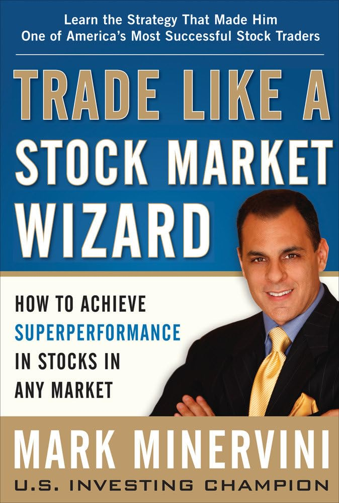
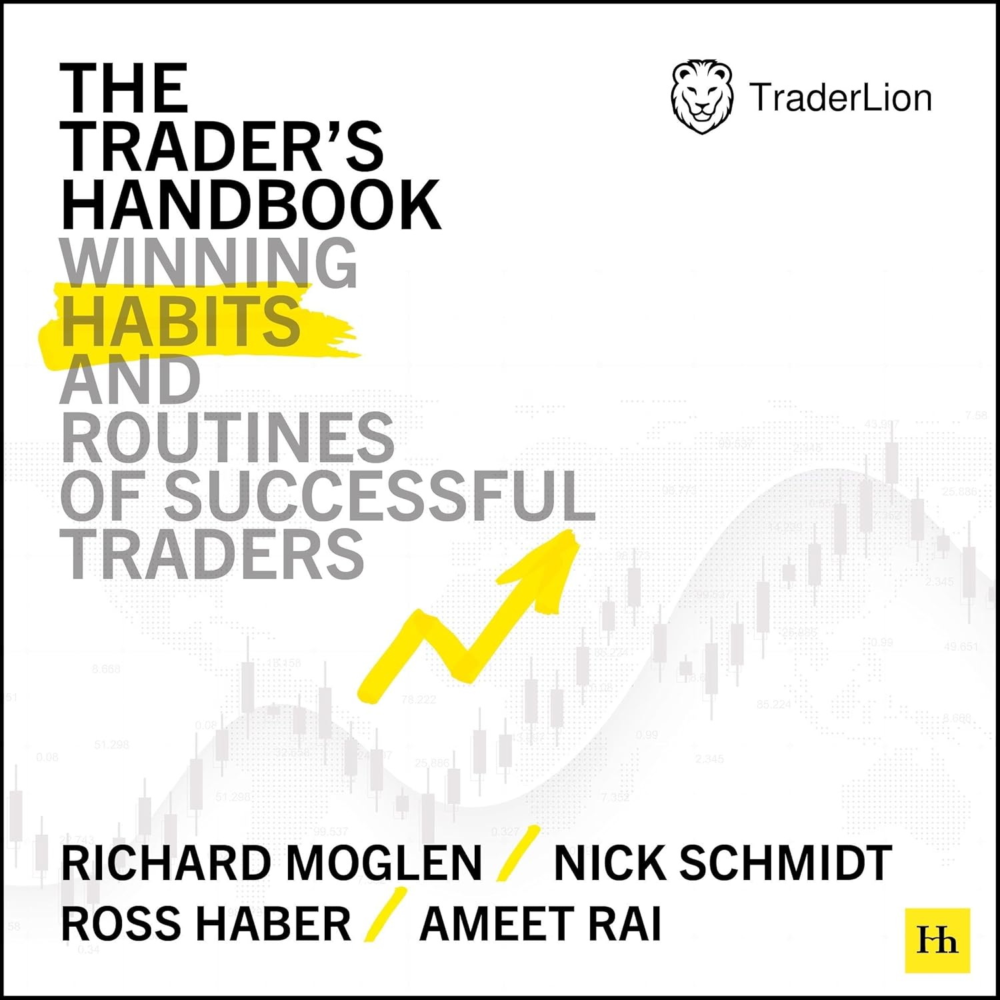
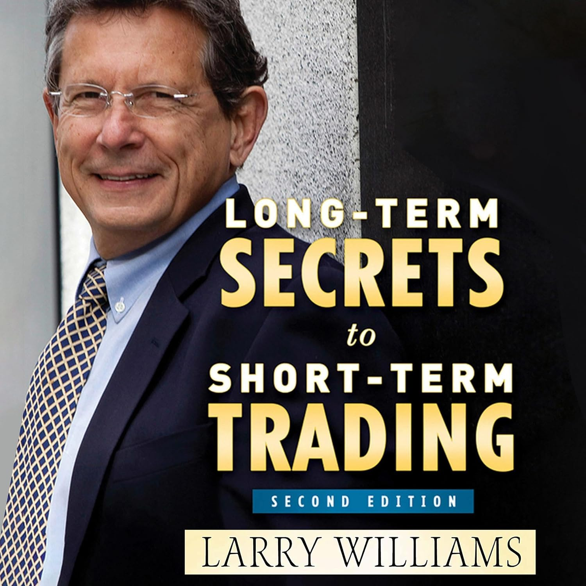

# 💸Dumok of WallStreet

> 성진의 Claude 금융 시장 분석 플러그인 v4.3.0


## 💾설치 방법

> 추후 작성 예정

## 📚전문가 소개

| 전문가 | 전문 분야 | 분석 시간대 | 참조 출처 |
|--------|----------|-----------|----------|
| Minervini | 실적 기반 기술적 분석 (SEPA) | 수 주 ~ 수 개월 | [Trade Like a Stock Market Wizard](https://a.co/d/0jkIyj9M) |
| Serenity | 공급망 병목 & 펀더멘탈 | 중기 (카탈리스트 기반) | [Twitter @aleabitoreddit](https://x.com/aleabitoreddit) |
| SidneyKim0 | 매크로 통계 & 레짐 분류 | 사이클 의존적 | [YouTube @sidneykim0](https://www.youtube.com/@sidneykim0) |
| TraderLion | 모멘텀 & 기관 매집 추적 | 5 ~ 20일 | [The Trader's Handbook](https://a.co/d/02mK4W3K) |
| Williams | 단기 변동성 돌파 | 2 ~ 5일 | [Long-Term Secrets to Short-Term Trading](https://a.co/d/09HI0QoX) |

---

### 1. Minervini

> "얼마를 잃을 수 있는가?"를 먼저 묻는 보수적 공격주의자. 펀더멘탈·기술적·정성적·시장 환경이 동시에 수렴할 때만 매수한다.

[](https://a.co/d/0jkIyj9M)

**방법론 특징**
- Trend Template 8가지 기준을 필수 통과해야 후보 자격
- Stage 2(상승 국면)에 있는 종목만 매수
- 실적 서프라이즈와 가속 추적 — 어닝 시즌이 곧 카탈리스트
- 리스크를 먼저 계산하고, 기대값이 맞을 때만 진입
- VCP(Volatility Contraction Pattern) 탐지 — 베이스 수축·셰이크아웃 구간 판별
- 4가지 진입 기법: Pivot Breakout, Pocket Pivot, Low Cheat, 3C Pattern
- 6가지 기업 카테고리 분류(Market Leader·Top Competitor·Turnaround 등)에 따른 맞춤 분석

**이런 질문을 해보세요**

| 질문 유형 | 예시 질문 |
|----------|----------|
| 시장 환경 | "Distribution day가 쌓이고 있는데, 아직 confirmed uptrend 맞아?" |
| 종목 진단 | "NVDA가 Stage 2에서 아직 Trend Template 기준 다 충족하고 있어?" |
| 종목 발굴 | "직전 실적에서 EPS 가속이 확인된 Stage 2 초입 종목 찾아줘" |
| 매매 타이밍 | "CELH가 VCP 3차 조정 중인데, Pocket Pivot 진입 가능한 자리야?" |
| 포지션 관리 | "SMCI가 50일선 아래로 내려왔는데, Stage 3 진입 신호로 봐야 해?" |
| 리스크 점검 | "PER 50배인데 어닝 가속 감안하면 성장 프리미엄으로 정당화돼?" |
| 종목 비교 | "CRWD랑 PANW 중에 Category Leader로서 SEPA 점수 높은 건?" |

**기대할 수 있는 분석**: Trend Template 통과 여부, Stage 분석, 실적 가속 추이, 매수/매도 시그널과 근거, 리스크 대비 기대수익 계산까지 포함된 종합 진단을 받을 수 있습니다.

---

### 2. Serenity

> 모든 투자 판단은 물리적 공급망 추적에서 시작한다. 차트 위의 선보다 float과 펀더멘탈을 먼저 본다.

[](https://x.com/aleabitoreddit)

**방법론 특징**
- 6단계 증거 체인: 매크로 → 섹터 → 병목 → 기업 → 밸류에이션 → 카탈리스트
- 공급망 병목이 곧 투자 기회 — 수요 > 공급 구간을 찾는다
- First-principles 밸류에이션으로 현재 가격의 합리성 검증
- 카탈리스트 타이밍에 맞춰 진입, 테마 포트폴리오 구성 가능
- 5-Layer 공급망 분해(완제품 → 원재료)로 비직관적 병목 발견
- 6기준 Bottleneck Scoring — 공급 집중도·증설 리드타임·지정학 리스크·대체재 유무 등
- No-Growth Stress Test, Sum-of-Parts 밸류에이션으로 하방 시나리오 검증

**서브커맨드**

| 서브커맨드 | 설명 |
|-----------|------|
| recheck | Position monitoring with action signals and verdict |
| discover | Automated theme discovery with bottleneck candidate validation |
| cross-chain | Shared supplier detection via SEC entity cross-matching |

**이런 질문을 해보세요**

| 질문 유형 | 예시 질문 |
|----------|----------|
| 매크로 환경 | "Hyperscaler CapEx가 전년 대비 40% 늘었는데, 그 돈이 공급망 어디로 흘러가?" |
| 종목 진단 | "ANET의 Layer 2 포지션에서 Bottleneck Score 몇 점이야? 대체재 리스크는?" |
| 테마 발굴 | "AI 추론 수요가 학습을 넘어서기 시작하면, 공급망에서 새로 병목 걸리는 Layer가 어디야?" |
| 공급망·병목 | "HBM 공급이 3사 과점인데, 2026년 capacity 확장 일정 감안해도 병목 유지돼?" |
| 포지션·리스크 | "TSMC에 LEAPS로 진입하려는데, No-Growth Stress Test 기준 밸류에이션 바닥은?" |
| 포트폴리오 | "AI 인프라 테마로 Evolution / Bottleneck / Disruption 각 카테고리별 포트폴리오 구성해줘" |

**기대할 수 있는 분석**: 매크로부터 기업까지 6단계를 관통하는 증거 체인, 공급망 병목 스코어링, 펀더멘탈 기반 밸류에이션, 그리고 카탈리스트 타임라인이 포함된 분석을 받을 수 있습니다.

---

### 3. SidneyKim0

> 내러티브보다 숫자. 매크로 레짐을 먼저 분류하고, 확률과 표본 크기로 말한다.

[](https://www.youtube.com/@sidneykim0)

**방법론 특징**
- 시장 사이클 분류: 실적장세 / 역금융장세 / 역실적장세 / 유동성쏠림
- 교차자산 괴리 탐지 — 금리·주가·골드·달러 간 불일치를 포착
- 역사적 유사 구간 매칭으로 확률적 시나리오 구성
- US 시장 전용
- 5단계 Data Cascade: 금리 레짐 → 달러 구조 → 교차자산 심리 → 실물 경기 → 개별 자산
- HOPE Cycle(원자재 → PPI → CPI → 금리 정책 → 자산 가격) 단계별 추적
- Z-score·잔차 분석·롤링 상관 등 정량 모델 기반 극단값 탐지

**이런 질문을 해보세요**

| 질문 유형 | 예시 질문 |
|----------|----------|
| 시장 레짐 | "ISM 반등 + 실업률 4% 미만이면 울-시어링 사이클 진입 조건 충족이야?" |
| 교차자산 괴리 | "10년물 금리가 오르는데 금도 같이 오르고 있어. 이 괴리 역사적으로 어떻게 해소됐어?" |
| 역사적 유사기간 | "현재 ERP 수준과 CAPE가 동시에 이 레벨이었던 과거 구간은? 이후 12개월 수익률 분포는?" |
| 매크로 데이터 | "HOPE 사이클 기준으로 PPI→CPI 전이가 지금 어느 단계야? 다음 변곡점은?" |
| 정량 모델 | "HY 스프레드 Z-score가 -2σ 아래로 떨어졌는데, 과거 유사 표본에서 3개월 뒤 S&P 분포는?" |
| 밸류에이션 | "현재 Earnings Yield 대비 10년물 금리 차이(ERP)가 위험 수준이야?" |
| 전략 포지셔닝 | "바벨 레짐 신호 나오고 있는데, 중간 위험 자산 비중 줄여야 해?" |

**기대할 수 있는 분석**: 현재 시장이 어떤 사이클에 있는지 데이터 기반으로 분류하고, 교차자산 괴리와 역사적 유사 구간을 근거로 확률적 시나리오를 제시합니다.

---

### 4. TraderLion

> 예측이 아닌 프로세스. 볼륨 엣지와 상대강도로 기관 매집을 식별하고, 시장 사이클에 따라 공격도를 조절한다.

[](https://a.co/d/02mK4W3K)

**방법론 특징**
- S.N.I.P.E. 워크플로우: 체계적 종목 발굴 → 진입 → 관리 프로세스
- 볼륨 엣지(HVE/HVIPO/HV1)로 기관 참여 여부 판별
- 엣지당 +2.5% 포지션 사이징 — 근거가 많을수록 비중 확대
- 시장 사이클에 따른 공격도 조절 (확인된 상승장에서만 풀 사이즈)
- TIGERS 6차원 종목 선별: Theme·Innovation·Growth·Edges·Relative Strength·Setup
- 11가지 진입 전술(변동성 돌파·갭필·언더컷 앤 랠리·MA 반등 등)
- Winning Characteristics 12항목 체크리스트로 기관 매수 퀄리티 검증

**이런 질문을 해보세요**

| 질문 유형 | 예시 질문 |
|----------|----------|
| 시장 사이클 | "Cycle Score 기준으로 지금 Upcycle이야? 풀사이즈 포지션 잡아도 되는 구간이야?" |
| 엣지 평가 | "PLTR에서 최근 HVE 시그널 나왔어? Up/Down volume ratio 추세도 같이 봐줘" |
| 셋업·진입 | "AXON이 10주 베이스에서 tightening 보이는데, Launch Pad 조건 충족했어?" |
| 스크리닝 | "3개월 RS 상위 + 최근 HVE 발생 + 25% 이상 EPS 가속 종목 S.N.I.P.E. 돌려줘" |
| 리스크·포지션 | "엣지 3개 확인된 종목인데, 포지션 사이즈 얼마로 잡아야 해?" |
| 루틴·리뷰 | "이번 트레이드에서 Tennis Ball 패턴 나왔는데, 지금 매도 타이밍 맞아?" |
| 종목 비교 | "PLTR이랑 AXON 중에 Winning Characteristics 점수 높은 건 어디야?" |

**기대할 수 있는 분석**: 시장 환경 진단, 볼륨 엣지 기반 기관 매집 신호, 상대강도 랭킹, 진입 셋업 판정, 그리고 엣지 수에 따른 포지션 사이징 권고를 받을 수 있습니다.

---

### 5. Williams

> 모든 트레이드는 규칙 기반. 변동성 돌파로 진입하고, 첫 수익 시가에 청산한다. 채권이 주식을 이끈다.

[](https://a.co/d/09HI0QoX)

**방법론 특징** (Pipeline-Complete v3.3.0)
- 변동성 돌파 시스템: Open + Pct × ATR로 기계적 진입 레벨 산출
- TDW/TDM 캘린더 바이어스 — 요일·거래일 기반 통계적 편향 활용
- 채권 필터(TLT) — 채권 시장이 주식 방향의 선행 지표
- 11개 팩터 듀얼 스코어링 (Long/Short 각 100점) — Hard/Soft Gates + 보너스 포인트
- 12개 차트 패턴 탐지 (Bullish 5개 + Bearish 6개 + Neutral 1개, 확인 상태 포함)
- GSV (Greatest Swing Value) — 실패 스윙 측정 기반 진입/손절 레벨
- 포지션 관리 리체크 — Long/Short 양방향 출구 시그널 + 판정(HOLD/EXIT/COVER)
- 2~5일 보유, 첫 수익 시가에 청산하는 단기 트레이딩

**이런 질문을 해보세요**

| 질문 유형 | 예시 질문 |
|----------|----------|
| 시장 환경 | "TLT가 14일 채널 하단 이탈했는데, 이거 BOND_CONTRADICTION으로 롱 진입 막히는 거야?" |
| 트레이드 검증 | "SPY에 Long 스코어 몇 점이야? Hard Gate 걸리는 항목 있어?" |
| 숏 트레이드 | "QQQ에 Bearish Hidden Smash Day 떴는데, Short 스코어 기준으로 진입 자격 돼?" |
| 패턴 발굴 | "최근 5일 내 Oops! 패턴이 confirmed 상태인 종목 있어?" |
| 진입 타이밍 | "내일 AAPL 변동성 돌파 매수 레벨이 얼마야? ATR 기준 Pct는?" |
| 포지션 관리 | "진입한 지 4일 됐는데 아직 수익 시가 안 나왔어. Time Stop 적용해야 해?" |
| 워치리스트 | "이 5종목 중에 TDW/TDM 캘린더 바이어스가 내일 가장 유리한 건?" |
| 퀵 체크 | "오늘 TDW 바이어스가 Bullish인데, Range Phase도 확장 구간이야?" |

**기대할 수 있는 분석**: 변동성 돌파 진입 레벨, TDW/TDM 캘린더 바이어스, 채권 인터마켓 필터 상태, 12개 패턴 탐지 결과(Bullish/Bearish/Neutral), Long/Short 듀얼 스코어링, 그리고 포지션 사이징까지 포함된 기계적 트레이드 판정을 받을 수 있습니다.

---

## 🤖MarketData 스킬

모든 전문가가 공유하는 데이터 수집 인프라입니다.

| 데이터 소스 | 제공 데이터 |
|-----------|-----------|
| YFinance | 주가, 재무제표, 기관/내부자 보유, 옵션 체인 |
| FRED | 금리, 인플레이션, 유동성, 매크로 지표 |
| SEC EDGAR | 13F 기관 보고, 내부자 거래, FTD, 공급망 인텔리전스 (10-K/10-Q) |
| Finviz | 스크리닝, 섹터 히트맵 |
| CFTC | 선물 포지셔닝 (COT 리포트) |
| CBOE | VIX, 풋/콜 비율, 변동성 커브 |

## 🏛️Debate

다중 전문가 토론 오케스트레이터입니다. "투자해도 돼?", "뭐 살까?"와 같은 넓은 질문을 받으면, 질문 유형에 맞는 2~4명의 전문가를 자동 선정하여 병렬로 독립 분석을 수행하고, 충돌 시 교차 검증 토론을 거쳐 종합 결론을 도출합니다.

| 질문 유형 | 선정 전문가 | 각 전문가의 역할 |
|----------|-----------|----------------|
| 시장 타이밍 | SidneyKim0 + Minervini + Williams | 매크로 레짐 / 섹터 리더십 / 채권 필터+캘린더 |
| 종목 심층분석 | Minervini + Serenity + TraderLion | SEPA 진단 / 공급망+밸류에이션 / 모멘텀+엣지 |
| 종목 발굴 | Minervini + Serenity + TraderLion | 리더 스크리닝 / 병목 발굴 / SNIPE 필터 |
| 리스크 점검 | SidneyKim0 + Minervini + Williams | 레짐+극단값 / 브로큰리더+브레스 / 채권+COT |
| 매매 타이밍 | Minervini + Williams + TraderLion | VCP/피봇 / 변동성돌파 / 엔트리 전술 |
| 종합 리뷰 | SidneyKim0 + Minervini + Serenity | 매크로 컨텍스트 / 포지션 점검 / 밸류에이션 |

**이런 질문을 해보세요**

| 질문 유형 | 예시 질문 |
|----------|----------|
| 시장 타이밍 | "지금 주식 투자해도 돼? 시장 상황이 어떤지 종합적으로 판단해줘" |
| 종목 심층분석 | "NVDA를 여러 관점에서 종합 분석해줘" |
| 종목 발굴 | "지금 뭐 사면 좋을까? 좋은 종목 추천해줘" |
| 리스크 점검 | "시장이 고점인 것 같은데, 얼마나 위험한 상황이야?" |
| 매매 타이밍 | "AAPL 지금 사도 돼? 진입 타이밍 맞아?" |
| 종합 리뷰 | "전체적으로 포트폴리오 점검 좀 해줘" |

**기대할 수 있는 분석**: 2~4명의 전문가가 각자의 방법론으로 독립 분석한 결과를 교차 검증하고, 합의 사항·논쟁 지점·종합 판정·실행 계획·통합 리스크 매트릭스를 포함한 다중 관점 종합 보고서를 받을 수 있습니다.

---

## ♻️Evolve

기존 전문가를 개선하거나 새로운 전문가를 추가하기 위한 메타-엔지니어링 도구입니다. Plan Mode에서 동작하며, 페르소나 파일·파이프라인·커맨드 생성을 체계적으로 안내합니다.

## 🗂️프로젝트 구조

```
Dumok-of-WallStreet/
├── .claude-plugin/
│   └── marketplace.json
├── .claude/
│   ├── .claude-plugin/plugin.json
│   ├── commands/          # Debate, Evolve, Minervini, Serenity, SidneyKim0, TraderLion, Williams
│   └── skills/MarketData/ # SKILL.md, Personas/, scripts/ (screening/, pipelines/), tools/
├── Docs/
│   ├── Examples/          # 분석 결과 예시 (추후 추가 예정)
│   └── Media/             # 이미지 리소스
├── CHANGELOG.db
├── Principles_Design.md   # 설계 철학 & 아키텍처 가이드
├── CLAUDE.md
└── README.md
```

## 🌏설계 철학

7가지 핵심 설계 원칙(Single Source of Truth, Persona Purity, Pipeline-Complete 등)과 아키텍처 상세는 [Principles_Design.md](Principles_Design.md)를 참조하세요.

## 🔥라이선스

Private repository. For personal use only.
