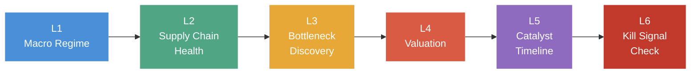
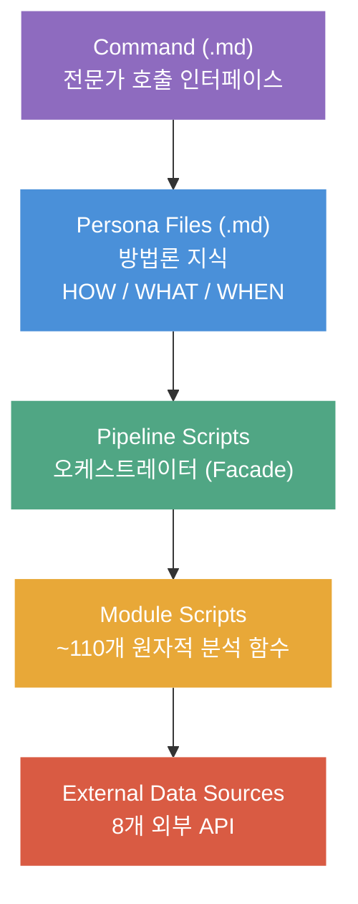

<div align="center">


# Dumok of Wall Street

**Claude Code를 월스트릿 전문 애널리스트로 만드는 오픈소스 플러그인**

[](CHANGELOG.db)
[](LICENSE)
[](https://www.python.org/)
[](https://claude.ai/code)
[](#marketdata-데이터-인프라)

<br>


</div>

<br>

## 무엇을 할 수 있나요?

Dumok of Wall Street는 [Claude Code](https://claude.ai/code)에 전문 투자 분석 역량을 부여하는 플러그인입니다. 실제 투자 전문가들의 방법론을 코드로 구현하여, 자연어 질문 하나로 기관급 분석 리포트를 생성합니다.

- **Mark Minervini의 SEPA 방법론**으로 성장주 종합 진단 (Trend Template, VCP, 실적 가속, 리스크 계산)
- **공급망 병목 아키텍처**로 비대칭 투자 기회 발굴 (7-Layer 공급망 분해, Dual-Valuation, Kill Signal)
- **8개 데이터 소스 통합** — YFinance, FRED, SEC EDGAR, Finviz, CFTC, CBOE, Dataroma, CME FedWatch
- **110개 이상의 분석 모듈** — 기술적 분석, 펀더멘탈, 매크로, 백테스트, 옵션, 밸류에이션

> **Quick Start** — 설치 후 바로 사용해 보세요
> ```
> /Minervini NVDA 분석해줘
> /Serenity AI 공급망에서 병목 걸리는 곳 어디야?
> ```

---

## 목차

- [전문가 소개](#전문가-소개)
  - [Minervini — SEPA 성장주 분석](#minervini)
  - [Serenity — 공급망 병목 분석](#serenity)
- [MarketData 데이터 인프라](#marketdata-데이터-인프라)
- [아키텍처](#아키텍처)
- [설치 방법](#설치-방법)
- [사용법](#사용법)
- [프로젝트 구조](#프로젝트-구조)
- [의존성 & 크레딧](#의존성--크레딧)
- [라이선스](#라이선스)

---

## 전문가 소개

| 전문가 | 전문 분야 | 분석 시간대 | 참조 출처 |
|--------|----------|-----------|----------|
| Minervini | 실적 기반 기술적 분석 (SEPA) | 수 주 ~ 수 개월 | [Trade Like a Stock Market Wizard](https://a.co/d/0jkIyj9M) |
| Serenity | 공급망 병목 & 펀더멘탈 | 중기 (카탈리스트 기반) | [Twitter @aleabitoreddit](https://x.com/aleabitoreddit) |

---

### Minervini

> "얼마를 잃을 수 있는가?"를 먼저 묻는 보수적 공격주의자.
> 펀더멘탈·기술적·정성적·시장 환경이 동시에 수렴할 때만 매수한다.

[](https://a.co/d/0jkIyj9M)

**방법론 특징**

- **SEPA 5-Element Composite Scoring** (0–100점) — Trend Quality, Fundamental Strength, Setup Readiness, Risk Profile 4차원 평가
- **Hard Gate 안전장치** — Stage 2 + Trend Template 8/8 통과 필수. 불합격 시 분석 자체가 중단됨
- **VCP(Volatility Contraction Pattern) 탐지** — Cup & Handle, Power Play, 3C Entry Point, Shakeout 구간 판별
- **Code 33 실적 가속 검증** — EPS/매출 Triple Acceleration + 서프라이즈 이력 + 애널리스트 수정 방향
- **6가지 기업 카테고리** 분류 — Market Leader, Top Competitor, Institutional Favorite, Turnaround, Comeback, Undiscovered
- **리스크 우선 계산** — Stop-loss, R:R 비율, 포지션 사이징이 진입 조건의 일부

**서브커맨드**

| 서브커맨드 | 설명 |
|-----------|------|
| `analyze` | 단일 종목 SEPA 종합 진단 (18개 모듈 병렬 실행, 0–100점 스코어링) |
| `discover` | 시장 환경 진단 + RS 리더 발굴 + Distribution Day 카운팅 + 섹터 리더십 대시보드 |

**이런 질문을 해보세요**

| 질문 유형 | 예시 질문 |
|----------|----------|
| 시장 환경 | "Distribution day가 쌓이고 있는데, 아직 confirmed uptrend 맞아?" |
| 종목 진단 | "NVDA가 Stage 2에서 아직 Trend Template 기준 다 충족하고 있어?" |
| 종목 발굴 | "직전 실적에서 EPS 가속이 확인된 Stage 2 초입 종목 찾아줘" |
| 매매 타이밍 | "CELH가 VCP 3차 조정 중인데, Pocket Pivot 진입 가능한 자리야?" |
| 포지션 관리 | "SMCI가 50일선 아래로 내려왔는데, Stage 3 진입 신호로 봐야 해?" |
| 종목 비교 | "CRWD랑 PANW 중에 Category Leader로서 SEPA 점수 높은 건?" |

**기대할 수 있는 분석**: Trend Template 통과 여부, Stage 분석, 실적 가속 추이, VCP 셋업 품질, 매수/매도 시그널과 근거, 리스크 대비 기대수익 계산까지 포함된 종합 진단을 받을 수 있습니다.

---

### Serenity

> 모든 투자 판단은 물리적 공급망 추적에서 시작한다.
> 차트 위의 선보다 float과 펀더멘탈을 먼저 본다.

[](https://x.com/aleabitoreddit)

**6-Level 분석 프레임워크**


```mermaid
flowchart LR
    L1["L1\nMacro Regime"] --> L2["L2\nSupply Chain\nHealth"]
    L2 --> L3["L3\nBottleneck\nDiscovery"]
    L3 --> L4["L4\nValuation"]
    L4 --> L5["L5\nCatalyst\nTimeline"]
    L5 --> L6["L6\nKill Signal\nCheck"]

    style L1 fill:#4a90d9,color:#fff,stroke:none
    style L2 fill:#50a684,color:#fff,stroke:none
    style L3 fill:#e8a838,color:#fff,stroke:none
    style L4 fill:#d95b43,color:#fff,stroke:none
    style L5 fill:#8e6bbf,color:#fff,stroke:none
    style L6 fill:#c0392b,color:#fff,stroke:none
```

**방법론 특징**

- **7-Layer 공급망 분해** — 완제품에서 원재료까지 재귀적 병목 발견 + Nested Bottleneck
- **10가지 테시스 형성 패턴** — Mag7 Customer Discovery, Forward Revenue Disconnect, Bottleneck Discovery, IV Mispricing, SI Trap, Catalyst-First 등
- **8가지 Kill Signal** — 테시스 무효화 기준 (MC/Valuation Disconnect, Suspicious Fundamentals, Meme Trap, Serial Dilution 등)
- **Dual-Valuation 필수** — No-Growth 바닥가 + 성장 Upside 동시 제시
- **SEC 공시 지능** — 10-K/10-Q/20-F 전문을 Gemini LLM으로 추출, XBRL 정량 데이터 보충 (매출 집중도, 지리적 매출, 재고 구성, 구매 의무)
- **20-F 지원** — 외국계 비상장 발행자(TSMC, ASML)에 대한 자동 폴백
- **6-Criteria Bottleneck Scoring** — 수요/공급 불균형, 과점도, 대체재 부재, 지리적 리스크 등 정량 평가

**서브커맨드**

| 서브커맨드 | 설명 |
|-----------|------|
| `macro` | Level 1 매크로 레짐 판단 (실적장세/금융장세/역실적장세 분류) |
| `analyze` | 단일 종목 6-Level 종합 분석 (SEC 공시 LLM 추출 포함) |
| `discover` | 테마 기반 자동 발굴 (`--industry`, `--sector` 옵션) |

**이런 질문을 해보세요**

| 질문 유형 | 예시 질문 |
|----------|----------|
| 매크로 환경 | "Hyperscaler CapEx가 전년 대비 40% 늘었는데, 그 돈이 공급망 어디로 흘러가?" |
| 종목 진단 | "ANET의 Layer 2 포지션에서 Bottleneck Score 몇 점이야? 대체재 리스크는?" |
| 테마 발굴 | "AI 추론 수요가 학습을 넘어서기 시작하면, 공급망에서 새로 병목 걸리는 Layer가 어디야?" |
| 공급망·병목 | "HBM 공급이 3사 과점인데, 2026년 capacity 확장 일정 감안해도 병목 유지돼?" |
| 밸류에이션 | "TSMC에 LEAPS로 진입하려는데, No-Growth Stress Test 기준 밸류에이션 바닥은?" |
| 포트폴리오 | "AI 인프라 테마로 Evolution / Bottleneck / Disruption 카테고리별 포트폴리오 구성해줘" |

**기대할 수 있는 분석**: 매크로부터 기업까지 6단계를 관통하는 증거 체인, 공급망 병목 스코어링, 펀더멘탈 기반 밸류에이션, 그리고 카탈리스트 타임라인이 포함된 분석을 받을 수 있습니다.

---

## MarketData 데이터 인프라

모든 전문가가 공유하는 데이터 수집·분석 인프라입니다. 11개 카테고리, 110개 이상의 원자적 모듈로 구성됩니다.

### 데이터 소스

| 소스 | 제공 데이터 |
|-----|-----------|
| [YFinance](https://github.com/ranaroussi/yfinance) | 주가 OHLCV, 재무제표, 옵션 체인, 기관/내부자 보유, 어닝 캘린더 |
| [FRED](https://github.com/mortada/fredapi) | 금리 (Fed Funds, Treasury), 인플레이션 (CPI/PPI/PCE), 유동성, 매크로 지표 |
| [SEC EDGAR](https://github.com/dgunning/edgartools) | 10-K/10-Q/20-F 공시, 13F 기관 보고, Form 4 내부자 거래, 공급망 인텔리전스 |
| [Finviz](https://github.com/mariostoev/finviz) | 종목 스크리닝, 섹터/산업군 성과, 시장 breadth (52주 신고가/신저가) |
| CFTC | 선물 포지셔닝 — Commitment of Traders (COT) 리포트 |
| CBOE | VIX 선물 곡선, 내재변동성 (IV Rank/Percentile), 풋/콜 비율 |
| Dataroma | Superinvestor 81명의 13F 포트폴리오 (Buffett, Ackman 등) |
| CME FedWatch | FOMC 금리 변경 확률, 미팅 일정 |

### 모듈 카탈로그

<details>
<summary><b>Pipelines</b> — 페르소나별 분석 오케스트레이터</summary>

| 파이프라인 | 설명 |
|-----------|------|
| `minervini` | SEPA 5-element composite (0–100), hard gate (Stage 2 + TT 8/8), VCP 합성, Code 33, 리스크 평가, 포지션 사이징, 시장 대시보드, 섹터 스크리닝, 멀티 비교, 리체크 |
| `serenity` | 6-Level pipeline: 매크로 레짐, 5 health gates, SEC dilution 검증, LLM 추출, XBRL 보충, 6-Criteria Bottleneck scoring, geo-risk, 섹터 비의존적 |

</details>

<details>
<summary><b>Statistics</b> (8) — Z-score, 상관관계, 분포, 극단값</summary>

| 모듈 | 설명 |
|-----|------|
| `zscore` | 주가/수익률 Z-score로 통계적 과매수/과매도 판별 |
| `percentile` | 백분위 랭킹 분석 |
| `correlation` | 두 종목 간 상관관계 강도 및 레짐 변화 식별 |
| `multi_correlation` | 다종목 상관 매트릭스 및 페어 랭킹 |
| `cointegration` | Engle-Granger 공적분 검정 (페어 트레이딩) |
| `distribution` | 수익률 분포 통계 (왜도, 첨도, 꼬리 리스크) |
| `extremes` | 임계 시그마 초과 극단 이벤트 탐지 |
| `multi_extremes` | 다자산 동시 극단 Z-score 탐지 |

</details>

<details>
<summary><b>Technical</b> (26) — RS 랭킹, Stage 분석, VCP, 진입 패턴, 볼륨 분석</summary>

| 모듈 | 설명 |
|-----|------|
| `rs_ranking` | IBD 방식 RS Rating (0–99), Finviz 고RS 스크리닝 |
| `stage_analysis` | Minervini Stage 1–4 분류, 전환 신호 탐지 |
| `vcp` | VCP, Cup & Handle, Power Play, 3C 진입, Shakeout 그레이딩 |
| `base_count` | Stage 2 내 베이스 번호 추적 + 패턴 분류 + 리스크 평가 |
| `trend` | SMA, EMA, Bollinger Bands 추세 지표 |
| `indicators` | 기술 지표 계산 함수 |
| `oscillators` | RSI, MACD 모멘텀 오실레이터 |
| `entry_patterns` | MA 풀백, 컨솔리데이션 피봇, Inside Day, Gap Reversal 등 |
| `pocket_pivot` | 기관 매수 신호 (베이스 내 볼륨 돌파) |
| `low_cheat` | 피봇 아래 타이트 컨솔리데이션 저위험 진입 |
| `tight_closes` | 타이트 클로즈 클러스터 (매물 소진 확인) |
| `volume_analysis` | 기관 매집/분배 A–E 그레이딩 |
| `volume_edge` | HVE, HVIPO, HV1, 볼륨 런레이트 + 확신도 스코어링 |
| `closing_range` | Closing Range 계산 + Constructive/Non-constructive 분류 |
| `sell_signals` | MA 이탈, 고볼륨 반전, 수직 가속, 분배 클러스터 |
| `post_breakout` | Tennis Ball/Egg 행동, Squat 회복, 실패 리셋 |
| `special_patterns` | Positive Expectation Breaker, No Follow-Through Down, Undercut & Rally |
| `stock_character` | ADR%, Clean/Choppy 분류, MA 존중 일관성, 성격 등급 (A–D) |
| `slope` | 20일 롤링 가격 기울기 + RSI 파생 모멘텀 |
| `bar_patterns` | Outside Day, Smash Day, Hidden Smash Day, Oops! 패턴 |
| `atr_breakout` | ATR 기반 변동성 돌파 진입/청산 레벨 |
| `range_analysis` | Range 확장/수축 단계 탐지 |
| `swing_points` | 3계층 기계적 스윙 포인트 식별 |
| `gsv` | Greatest Swing Value 실패 스윙 측정 |
| `calendar_bias` | TDW/TDM 캘린더 바이어스 평가 |
| `williams_r` | Williams %R 모멘텀 오실레이터 |

</details>

<details>
<summary><b>Data Sources</b> (14) — 주가, 재무제표, 옵션, 어닝 가속</summary>

| 모듈 | 설명 |
|-----|------|
| `price` | OHLCV 히스토리, 멀티 다운로드, 실시간 시세 |
| `financials` | 손익계산서, 대차대조표, 현금흐름표 (연간/분기/TTM) |
| `info` | 기업 정보 (시가총액, PER, 베타, 유동주식수) |
| `earnings_acceleration` | Code 33 검증, EPS/매출 가속 패턴, 서프라이즈, 애널리스트 수정 |
| `options` | 옵션 체인, 내재변동성 |
| `holders` | 기관/내부자 지분, 거래 이력 |
| `actions` | 배당, 액면분할, 어닝 일정, 뉴스 |
| `calendars` | 어닝 캘린더, IPO 캘린더, 경제 이벤트 |
| `multi` | 멀티 티커 비교, 배치 다운로드 |
| `funds` | 뮤추얼 펀드/ETF 보유 데이터 |
| `search` | 티커 심볼 검색 |
| `market` | 시장 지수 데이터 |
| `bdi` | Baltic Dry Index 추적 + Z-score |
| `dxy` | Dollar Index 추적 + Z-score |

</details>

<details>
<summary><b>Analysis</b> (17) — 포지션 사이징, 밸류에이션, 마진, 부채, 기관 품질</summary>

| 모듈 | 설명 |
|-----|------|
| `position_sizing` | 리스크 기반 포지션 사이징, 피라미딩 (2%+2%+1%), Kelly Criterion |
| `forward_pe` | Forward P/E 계산 + Walmart 벤치마크 (45x) 비교 |
| `no_growth_valuation` | 0% 성장 스트레스 테스트 (매출 x 마진 x 15 P/E) + 안전마진 |
| `margin_tracker` | 마진 확장 추적: QoQ/YoY 변화 + EXPANDING/COMPRESSION 플래그 |
| `debt_structure` | 부채 구조, 이자보상비율, 금리 인상 시나리오 스트레스 테스트 |
| `institutional_quality` | 기관 보유 품질 스코어 (1–10), PASSIVE/LONG_ONLY/HEDGE/QUANT 분류 |
| `sbc_analyzer` | 주식보상(SBC) 분석: SBC 대비 매출 비율, 진짜 FCF 계산 |
| `capex_tracker` | 섹터 비의존적 CapEx 추적: QoQ/YoY 방향, 공급망 레이어별 건전성 |
| `bottleneck_scorer` | 병목 재무 검증: 4 health gates + 비대칭 스코어 + Supply Dominance |
| `convergence` | 다중 모델 수렴 분석 |
| `divergence` | 교차자산 상관 붕괴 탐지 |
| `analysis` | 애널리스트 컨센서스: EPS/매출 추정치, 목표가, 추천 등급 |
| `iv_context` | CBOE IV Rank/Percentile, HV30 비교, cheap/expensive 분류 |
| `leaps_scanner` | LEAPS 최적 옵션 탐색: 타겟 델타, 손익분기, 연간 비용 |
| `csp_yield` | Cash-Secured Put 수익률: 연환산 수익률, 손익분기, 하방 쿠션 |
| `putcall_ratio` | 풋/콜 비율 심리 분석 |
| `analysis_utils` | 분석 유틸리티 (상관, Z-score, 백분위 함수) |

</details>

<details>
<summary><b>Backtest</b> (6) — 조건부 확률, 이벤트 수익률, 극단 반전</summary>

| 모듈 | 설명 |
|-----|------|
| `conditional` | 조건 이벤트 발생 시 타겟 도달 조건부 확률 |
| `event_returns` | 트리거 이벤트 이후 선행 수익률 통계 |
| `extreme_reversals` | 극단 가격 이벤트 후 평균회귀 특성 측정 |
| `rate_cut_precedent` | 역대 Fed 금리 인하 사이클 후 S&P 500 수익률 분석 |
| `ratio` | 자산 가격 비율 기반 상대가치 평가 |
| `helpers` | 백테스트 핵심 헬퍼 함수 |

</details>

<details>
<summary><b>Macro</b> (7) — ERP, GBM 공정가치, 순유동성, VIX 곡선</summary>

| 모듈 | 설명 |
|-----|------|
| `erp` | Equity Risk Premium = Earnings Yield - US10Y |
| `gbm` | Geometric Brownian Motion 공정가치 모델 |
| `macro` | 매크로 모델 + 공정가치 분석 |
| `macro_inference` | Rolling OLS/Ridge 회귀, 잔차 Z-score, 민감도 분석 |
| `net_liquidity` | Fed 순유동성 (Balance Sheet - TGA - RRP) |
| `vix_curve` | VIX 선물 곡선: 콘탱고/백워데이션, 레짐 분류 (complacent/panic) |
| `macro_utils` | 매크로 분석 유틸리티 함수 |

</details>

<details>
<summary><b>Screening</b> (4) — Finviz 스크리닝, Trend Template, 섹터 리더</summary>

| 모듈 | 설명 |
|-----|------|
| `finviz` | 조건 기반 스크리닝, 섹터/산업군 분석, 52주 신고가/신저가 |
| `finviz_presets` | 사전정의 스크리닝 프리셋 (Minervini SEPA 등) |
| `trend_template` | Minervini Trend Template 8-criteria Stage 2 자격 검증 |
| `sector_leaders` | Bottom-up 섹터 리더십 대시보드 |

</details>

<details>
<summary><b>Valuation</b> (3) — CAPE, 배당수익률</summary>

| 모듈 | 설명 |
|-----|------|
| `cape` | CAPE (Shiller P/E) 비율 데이터 |
| `cape_historical` | Robert Shiller 데이터셋 기반 역사적 CAPE |
| `dividend_yield` | S&P 500 배당수익률 계산 |

</details>

<details>
<summary><b>Advanced Data — FRED</b> (4) — 금리, 인플레이션, 정책</summary>

| 모듈 | 설명 |
|-----|------|
| `rates` | Fed Funds, SOFR, Treasury 수익률, TIPS, 모기지 금리 |
| `inflation` | CPI, PPI, PCE, 핵심 인플레이션 추세 |
| `policy` | 실업률, 소매판매, ISM PMI, 실업수당 청구 |
| `series` | FRED 시리즈 범용 조회 유틸리티 |

</details>

<details>
<summary><b>Advanced Data — Fed</b> (2) — FedWatch, FOMC 캘린더</summary>

| 모듈 | 설명 |
|-----|------|
| `fedwatch` | CME FedWatch Tool — FOMC 금리 변경 확률 |
| `fomc_calendar` | 연준 FOMC 미팅 일정 |

</details>

<details>
<summary><b>Advanced Data — SEC</b> (6) — 공시, 내부자 거래, 공급망 인텔리전스</summary>

| 모듈 | 설명 |
|-----|------|
| `filings` | SEC 기업 공시 접근 + MD&A 추출 |
| `supply_chain` | 10-K/10-Q/20-F 공급망 추출 (Gemini LLM + XBRL): 공급자, 고객, 단일소스 의존, 지리적 집중도, 용량 제약 |
| `insider` | SEC Form 4 내부자 거래 추적 |
| `institutions` | SEC 13F 기관 보유 조회 |
| `events` | SEC 8-K 공급망 이벤트 탐지: 주요 계약, 인수, 공급 차질 |
| `ftd` | Failures to Deliver + 소송 공시 |

</details>

<details>
<summary><b>Advanced Data — CFTC</b> (1) — 선물 포지셔닝</summary>

| 모듈 | 설명 |
|-----|------|
| `cftc` | Commitment of Traders (COT) 데이터: 상업적/투기적/소규모 트레이더 포지셔닝 |

</details>

<details>
<summary><b>Sentiment & Pattern</b> (6) — Fear & Greed, 패턴 매칭, 레짐 탐지</summary>

| 모듈 | 설명 |
|-----|------|
| `fear_greed` | CNN Fear & Greed Index (7개 지표 합성) |
| `multi_dtw` | 다차원 DTW 패턴 매칭 (가격+RSI+기울기+변동성+D2H) |
| `regime` | 시장 레짐 탐지 |
| `similarity` | 패턴 유사도 분석 |
| `fanchart` | 팬 차트 시각화 |
| `helpers` | 패턴 분석 헬퍼 (DTW, 상관, 선행 수익률) |

</details>

---

## 아키텍처


```mermaid
flowchart TD
    CMD["Command (.md)\n전문가 호출 인터페이스"]
    PERSONA["Persona Files (.md)\n방법론 지식\nHOW / WHAT / WHEN"]
    PIPELINE["Pipeline Scripts\n오케스트레이터 (Facade)"]
    MODULES["Module Scripts\n~110개 원자적 분석 함수"]
    DATA["External Data Sources\n8개 외부 API"]

    CMD --> PERSONA
    PERSONA --> PIPELINE
    PIPELINE --> MODULES
    MODULES --> DATA

    style CMD fill:#8e6bbf,color:#fff,stroke:none
    style PERSONA fill:#4a90d9,color:#fff,stroke:none
    style PIPELINE fill:#50a684,color:#fff,stroke:none
    style MODULES fill:#e8a838,color:#fff,stroke:none
    style DATA fill:#d95b43,color:#fff,stroke:none
```

**Progressive Disclosure** — 2단계 발견 프로토콜로 컨텍스트 효율성을 극대화합니다.

1. **Level 1**: `SKILL.md` — 전체 모듈 카탈로그 (함수명 + 한줄 설명)
2. **Level 2**: `extract_docstring.py` — 개별 스크립트의 정확한 서브커맨드와 인터페이스 추출

### 설계 원칙

| # | 원칙 | 설명 |
|---|------|------|
| 1 | **Single Source of Truth** | Docstring이 코드의 유일한 진실 |
| 2 | **Persona Purity** | 각 커맨드는 자신의 파이프라인만 사용 |
| 3 | **Pipeline-Complete** | 방법론에 필요한 모든 모듈 호출이 파이프라인 내에 내장 |
| 4 | **Context Efficiency** | 파생 메트릭만 반환, 원본 데이터는 제외 |
| 5 | **Progressive Disclosure** | 2단계 발견: SKILL.md → extract_docstring.py |
| 6 | **Graceful Degradation** | 개별 컴포넌트 실패 시에도 분석 계속 |
| 7 | **Module Neutrality** | 모듈은 페르소나에 비의존적; 조합과 가중치가 정체성 결정 |
| 8 | **Self-Documenting Output** | 모든 스코어에 value + unit + thresholds 포함 |

> 아키텍처 상세는 [Principles_Design.md](Principles_Design.md)를 참조하세요.

---

## 설치 방법

### 사전 요구사항

- [Python 3.10+](https://www.python.org/downloads/)
- [Claude Code CLI](https://claude.ai/code)

### 방법 1: 마켓플레이스 설치 (권장)

Claude Code 내에서 아래 명령어를 실행합니다.

```bash
# 1. 마켓플레이스 등록
/plugin marketplace add tjdwls101010/Claude_Seongjin

# 2. 플러그인 설치
/plugin install invest@Claude_Seongjin
```

> 가상환경과 Python 의존성은 첫 실행 시 자동으로 설치됩니다.

### 방법 2: 수동 설치

```bash
# 1. 저장소 클론
git clone https://github.com/tjdwls101010/Claude_Seongjin.git
cd Claude_Seongjin

# 2. 가상환경 생성 + 의존성 설치
cd .claude/skills/MarketData/scripts
python3 -m venv .venv
.venv/bin/pip install -r requirements.txt
```

### 환경변수 설정

`.claude/skills/MarketData/.env` 파일을 생성합니다.

```env
# FRED 경제 데이터 API (필수)
# https://fred.stlouisfed.org/docs/api/api_key.html 에서 무료 발급
FRED_API_KEY=your_key_here

# Gemini API (선택 — SEC 공급망 LLM 추출에 사용)
GOOGLE_API_KEY=your_key_here
```

---

## 사용법

Claude Code에서 `/Minervini` 또는 `/Serenity` 명령어를 사용합니다. 자연어 한국어 질문을 그대로 입력하면 됩니다.

**Minervini 예시**

```
/Minervini NVDA 분석해줘
/Minervini 지금 시장 환경 어때? Distribution day 카운팅해줘
/Minervini EPS 가속 + Stage 2 초입 종목 찾아줘
/Minervini CRWD vs PANW 비교해줘
```

**Serenity 예시**

```
/Serenity 매크로 환경 분석해줘
/Serenity ANET 공급망 병목 분석해줘
/Serenity AI 추론 수요 관련 병목 종목 발굴해줘
/Serenity HBM 공급망에서 TSMC 밸류에이션 바닥은?
```

> 각 전문가는 파이프라인 기반으로 자동 체이닝됩니다. 질문 유형에 따라 필요한 서브커맨드를 자동 선택하고, 관련 모듈들을 병렬 실행합니다.

---

## 프로젝트 구조

```
Dumok-of-WallStreet/
├── .claude/
│   ├── .claude-plugin/
│   │   └── plugin.json                    # 플러그인 메타데이터 (v6.6.0)
│   ├── commands/
│   │   ├── Minervini.md                   # Minervini 전문가 커맨드
│   │   └── Serenity.md                    # Serenity 전문가 커맨드
│   └── skills/MarketData/
│       ├── SKILL.md                       # 모듈 카탈로그 (Level 1)
│       ├── Personas/
│       │   ├── Minervini/                 # SEPA 방법론 (3 파일)
│       │   └── Serenity/                  # 공급망 방법론 (3 파일)
│       ├── scripts/
│       │   ├── pipelines/
│       │   │   ├── minervini/             # SEPA 파이프라인 (8 모듈)
│       │   │   └── serenity/              # 6-Level 파이프라인 (14 모듈)
│       │   ├── technical/                 # 기술적 분석 (26 모듈)
│       │   ├── data_sources/              # 데이터 소스 (14 모듈)
│       │   ├── analysis/                  # 펀더멘탈 분석 (17 모듈)
│       │   ├── statistics/                # 통계 분석 (8 모듈)
│       │   ├── backtest/                  # 백테스트 (6 모듈)
│       │   ├── macro/                     # 매크로 분석 (7 모듈)
│       │   ├── screening/                 # 종목 스크리닝 (4 모듈)
│       │   ├── valuation/                 # 밸류에이션 (3 모듈)
│       │   └── data_advanced/             # FRED, Fed, SEC, CFTC
│       └── tools/
│           └── extract_docstring.py       # Level 2 인터페이스 발견
├── .claude-plugin/
│   └── marketplace.json                   # 마켓플레이스 메타데이터
├── Docs/
│   └── Media/                             # 이미지 리소스
├── Principles_Design.md                   # 설계 철학 & 아키텍처 가이드
├── CLAUDE.md                              # 개발 가이드
├── CHANGELOG.db                           # 버전 이력 (SQLite)
└── requirements.txt                       # Python 의존성
```

---

## 의존성 & 크레딧

### 핵심 라이브러리

| 라이브러리 | 용도 | 링크 |
|-----------|------|------|
| **yfinance** | 주가/재무/옵션 데이터 | [ranaroussi/yfinance](https://github.com/ranaroussi/yfinance) |
| **finviz** | 종목 스크리닝 API | [mariostoev/finviz](https://github.com/mariostoev/finviz) |
| **finvizfinance** | Finviz 고급 스크리닝 | [lit26/finvizfinance](https://github.com/lit26/finvizfinance) |
| **IBD-RS-Rating** | 상대강도 랭킹 알고리즘 | [tjdwls101010/IBD-RS-Rating](https://github.com/tjdwls101010/IBD-RS-Rating) |
| **fredapi** | FRED 경제 데이터 API | [mortada/fredapi](https://github.com/mortada/fredapi) |
| **sec-edgar-downloader** | SEC 공시 다운로드 | [jadchaar/sec-edgar-downloader](https://github.com/jadchaar/sec-edgar-downloader) |
| **edgartools** | SEC EDGAR 구조화 접근 | [dgunning/edgartools](https://github.com/dgunning/edgartools) |
| **google-genai** | Gemini LLM SDK | [googleapis/python-genai](https://github.com/googleapis/python-genai) |
| **pandas** | 데이터 분석 프레임워크 | [pandas-dev/pandas](https://github.com/pandas-dev/pandas) |
| **numpy** | 수치 연산 | [numpy/numpy](https://github.com/numpy/numpy) |
| **pydantic** | 데이터 검증 | [pydantic/pydantic](https://github.com/pydantic/pydantic) |

### 방법론 출처

| 전문가 | 출처 | 참조 |
|--------|------|------|
| Minervini | Mark Minervini | [Trade Like a Stock Market Wizard](https://a.co/d/0jkIyj9M) |
| Serenity | @aleabitoreddit | [Twitter/X](https://x.com/aleabitoreddit) |

<div align="center">
<br>

<br>
Powered by <a href="https://claude.ai/code">Claude Code</a>
<br><br>
</div>

---

## 라이선스

[](LICENSE)

이 프로젝트는 MIT 라이선스 하에 배포됩니다. 자세한 내용은 [LICENSE](LICENSE) 파일을 참조하세요.

Copyright (c) 2026 Seongjin Ahn
